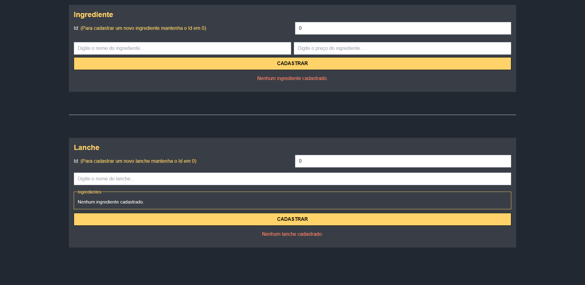
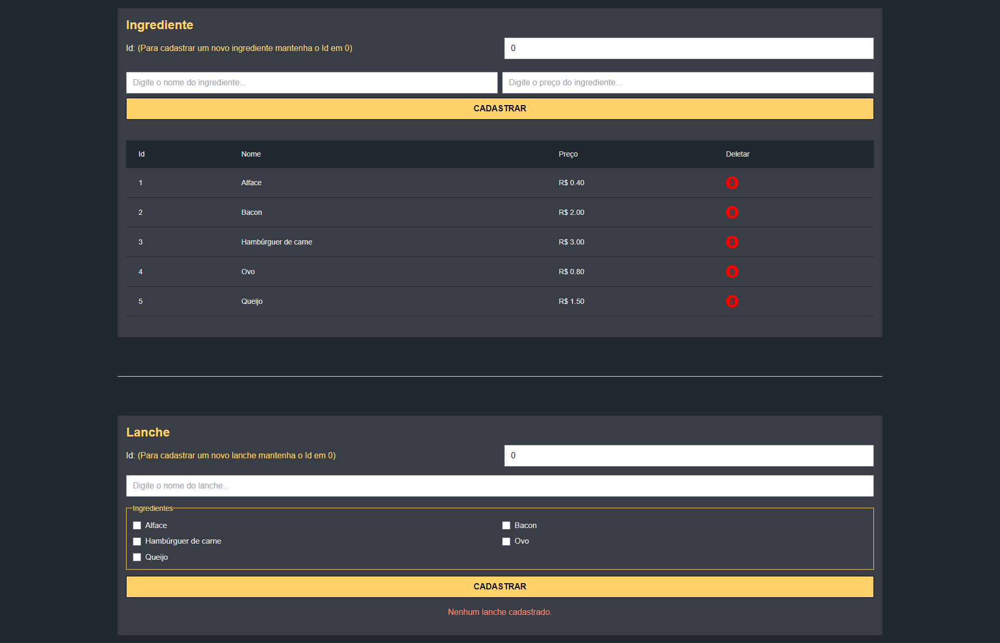
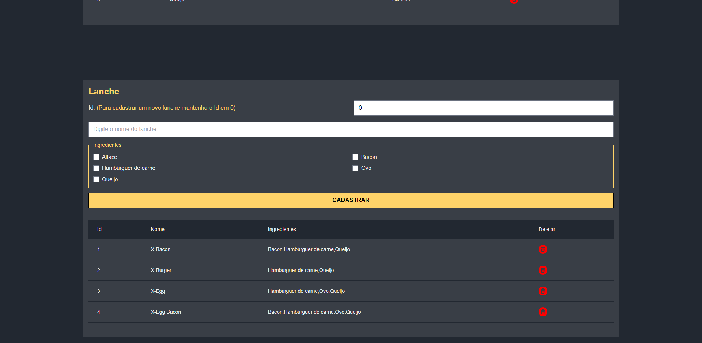

  

  <h3 align="center">Conforce - Dev Desafio</h3>

  

    Um site feito em React com integração a um backend feito em .NET, utilizando banco de dados em memória.
     
     
    <!-- <a href="https://conforce-vaga-dev-murilodpl.vercel.app">Go to Website</a> -->
    <!-- · -->
    <!-- <a href="https://github.com/murilodpl/conforce-vaga-dev/issues">Reportar um Bug</a> -->
    <!-- · -->
    <!-- <a href="https://github.com/murilodpl/conforce-vaga-dev/issues">Request Feature</a> -->
  

<!-- ÍNDICE -->

  
Índice

  <ol>
    <li>
      <a href="#sobre-o-projeto">Sobre o projeto</a>
      <ul>
        <li><a href="#feito-com">Feito com</a></li>
      </ul>
    </li>
    <li><a href="#contato">Contato</a></li>
  </ol>

<!-- Sobre o projeto -->
## Sobre o projeto

     
     
    

**Desafio Fullstack** *(Pastas client-side e server-side)*

Descrição:
Somos uma startup do ramo de alimentos e precisamos de uma aplicação web para gerir nosso negócio. Nossa especialidade é a venda de lanches, de modo que alguns lanches são opções de cardápio e outros podem conter ingredientes personalizados.

 A seguir, apresentamos a lista de ingredientes disponíveis:

| **INGREDIENTE** | **VALOR** |
| --- | --- |
| Alface | R$ 0.40 |
| Bacon | R$ 2,00 |
| Hambúrguer de carne | R$ 3,00 |
| Ovo | R$ 0,80 |
| Queijo | R$ 1,50 |

Segue as opções de cardápio e seus respectivos ingredientes:

| **LANCHE** | **INGREDIENTES** |
| --- | --- |
| X-Bacon | Bacon, hambúrguer de carne e queijo |
| X-Burger | Hambúrguer de carne e queijo |
| X-Egg | Ovo, hambúrguer de carne e queijo |
| X-Egg Bacon | Ovo, bacon, hambúrguer de carne e queijo |

O objetivo é a criação de uma tela para cadastro dos ingredientes e outra para cadastro dos lanches (Insert, update e delete).

Construa também uma tela para listar os ingredientes e os lanches.

**CRITÉRIOS DE ENTREGA**

O projeto deve ser entregue atendendo aos seguintes critérios

- O server-side preferencialmente deve ser desenvolvido em C#, .Net.
- O client-side deve ser desenvolvido preferencialmente em React.
- Será um diferencial possuir cobertura de testes automatizados.
- Não é necessário se preocupar com a autenticação dos usuários.
- Não é necessário persistir os dados em um banco, pode fazer armazenamento em memória.

O projeto deverá ser disponibilizado no Github até segunda, 06/06 as 9h.
 

***E um extra:***
**Exercício de lógica de programação** *(Arquivo prog-func.js)*

1. Faça uma função para calcular o dobro de um número qualquer.
2. Considerando que todos os meses tenham 30 dias, calcular o total de dias de n meses.

(<a href="#top">back to top</a>)

<!-- FEITO COM -->
### Feito com

#### Frontend (Client Side)
* [React.js](https://reactjs.org/)
* [Axios](https://axios-http.com/)
* [TailwindCSS](https://tailwindcss.com/)

#### Backend (Server Side)
* [.NET (C#)](https://dotnet.microsoft.com/en-us/languages/csharp/)

(<a href="#top">back to top</a>)

<!-- CONTATO -->
## Contato

Murilo Leopoldino - [Linkedin](https://www.linkedin.com/in/murilo-leopoldino) - mdpleopoldino@gmail.com

(<a href="#top">back to top</a>)

